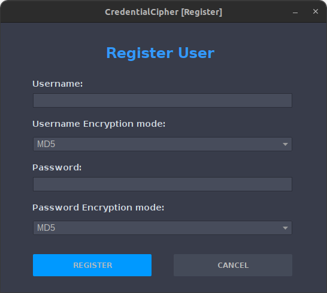

# 55RED - Projeto Criptografia

---

# 1. Descrição do Projeto

---

Implementação de um gerenciador de senhas de usuários de um sistema. As credenciais de cada usuário devem ser devidamente criptografadas e armazenadas de forma segura.

# 2. Requisitos do Projeto

---

- [ ]  O sistema deve permitir o usuário digitar usuário e senha;
- [ ]  A partir da senha, utilizando PBKDF2, derivar chaves que serão utilizadas como “boas chaves” no programa.
- [ ]  Utilizar PBKDF2 para derivar novas chaves quando necessário.
- [ ]  O sistema deve armazenar em um arquivo texto o valor hash proveniente do algoritmo SHA-256 do nome de usuário.
- [ ]  O sistema deve armazenar no mesmo arquivo do nome de usuário, a senha criptografada com AES-CBC. Assim, o arquivo não terá nenhum valor em claro.
- [ ]  IV (Nonce) e chave não podem estarem fixas e nem escritas dentro do código. O IV e a chave devem ficar em outro arquivo cifrado com AES-ECB.

# 3. Tecnologias utilizadas

---

- Java como linguagem de programação;
- Maven como geranciador de pacotes do Java;
- Biblioteca de Segurança **Bouncy Castle Provider** implementado em Java (disponível em: [https://mvnrepository.com/artifact/org.bouncycastle/bcprov-jdk15on/1.70](https://mvnrepository.com/artifact/org.bouncycastle/bcprov-jdk15on/1.70));
- Padrão DAO (Data Access Object) - Implementado para armazenamento em arquivos;
- Java Swing para interfaces de usuário;
- Biblioteca FlatLaf com belos visuais para Java Swing (disponível em: [https://central.sonatype.com/artifact/com.formdev/flatlaf?smo=true](https://central.sonatype.com/artifact/com.formdev/flatlaf?smo=true));

# 4. Interfaces de usuário

---

## 4.1. Interface de Registro de Novo Usuário

---

## 4.2. Interface de Login de Usuário

---

